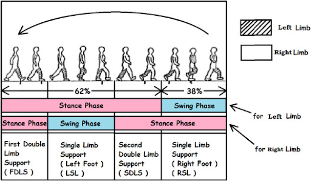
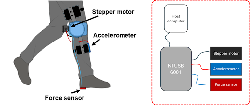
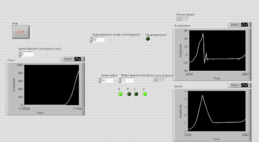

# A Simple Step Motor controlled with Force-Acceleration Sensor system for Knee Assist

**Emily Sperry and Phuong Tran**

## Abstract

This report describes the design and implementation of a prototype knee-assist device intended to support rehabilitation following knee surgery. The system uses a foot-mounted force sensor and a lower-leg accelerometer to detect gait phase and estimate limb velocity. A LabVIEW program processes these signals in realtime and commands a stepper motor to prevent hyperextension during stance and to resist excessive extension velocity during swing. This project demonstrates that even a simple, threshold-based control strategy can produce clinically relevant protective behavior.

---

## 1. Background and Motivation

### 1.1 Clinical Problem

Patients recovering from knee surgeries – including ACL reconstruction, ligament repair, and total knee replacement – frequently experience significant quadriceps weakness in the weeks following the procedure [1]. The quadriceps group is the primary dynamic stabilizer of the knee in extension, and when it is weakened, the knee joint becomes vulnerable to hyperextension: an excessive straightening beyond the neutral position that places abnormal stress on the ligaments, joint capsule, and surrounding structures of the posterior knee [2].

Repeated or forceful hyperextension episodes can cause pain, joint instability, and secondary injury, potentially undoing surgical repairs and prolonging recovery. Studies have found that up to half of post-surgical orthopedic patients exhibit knee hyperextension [3].

Current rehabilitation practice relies on manual supervision by a physical therapist, compliance with prescribed exercises, and sometimes a passive hinged brace that limits the mechanical range of motion [4]. While effective, these approaches are intermittent. A device that can monitor the knee in real time during everyday gait and intervene and entirely prevent unsafe movement at any speed could complement traditional rehabilitation and provide a safety net between supervised sessions.

### 1.2 The Human Gait Cycle

To understand where and why hyperextension risk arises, it is useful to review the normal walking gait cycle. A single gait cycle is defined as the period from one heel strike of a given foot to the next heel strike of the same foot. It is divided into two primary phases [5].

**Stance Phase** (approximately 60% of the gait cycle): The foot is in contact with the ground. The leg bears body weight, and the knee must remain stable. The cycle begins with initial contact (heel strike), progresses through loading response – where the knee flexes slightly to absorb impact – then mid-stance, where the knee is near full extension while the body's center of mass passes over the foot, and finally terminal stance, where the heel rises and the leg propels the body forward. It is during mid to terminal stance that hyperextension risk is highest in weakened patients, because the knee is near full extension and bearing significant load [6].

**Swing Phase** (approximately 40% of the gait cycle): The foot leaves the ground and the leg swings forward to prepare for the next heel strike. The knee flexes during initial swing to allow foot clearance, then extends again during terminal swing as the leg prepares to land.

A well-functioning knee-assist device must therefore respond differently in each phase to prevent the knee from reaching or exceeding a preset extension limit during stance, and dampen high-velocity extension during the final portion of swing. The prototype described in this report attempts to implement both these behaviors using simple threshold logic.

---

## 2. System Design

### 2.1 Hardware Configuration

The hardware setup is intentionally simple to focus on proof-of-concept validation. Three components form the core of the system:

- **Force sensor:** Mounted under the foot (insole position) to detect ground contact. The sensor output voltage rises with applied load, providing a continuous signal that distinguishes stance from swing.
- **Accelerometer (ADXL 335):** Mounted on the lower leg, close to the ankle, to capture shank kinematics. The y-axis component is used because it provides the clearest forward-motion signal during walking.
- **Small reduction stepper motor (5VDC 32-Step 1/16 Gearing) with joint mechanism:** Attached to a knee joint fixture. The motor provides precise positional control, making it suitable for stopping at a defined angle. The motor adjusts its motion depending on the sensor inputs.

The prototype is envisioned to be set up as shown. All sensor signals are routed through a National Instruments DAQ device to a host computer running the LabVIEW control program. Future hardware simplifications could be made using a printed circuit board (PCB) and microcontroller to avoid requiring a host computer.

### 2.2 Software Architecture

The LabVIEW VI runs a continuous control loop. The following signal flow is implemented:

- **Data acquisition:** For the purposes of this code, only simulation was implemented for the force sensor and accelerometer sensors, as hooking up the system to an actual leg was not possible.
  - For the accelerometer, real data is used that was collected from participants walking on a treadmill. The data was reshaped in Python, and put into a subVI. The data is continuously looped per speed to simulate real walking. As this is real data, there is no need to convert from voltage in m/s^2 [5].
  - For the force sensor, a simple gaussian curve was simulated. Using inputs of phase, known speed (from accelerometer), and dT, a subVI was created to simulate the force output for one foot.
- **Velocity estimation:** The acceleration signal is numerically integrated over time to produce an estimate of instantaneous shank velocity.
- **Speed-to-RPM mapping:** Shank velocity is converted to motor speed (RPM), which is implemented as the wait time of the while loop.
- **Motor direction:** The force sensor signal determines motor direction. As load increases (foot striking the ground), the motor drives in the forward direction; as load decreases (foot lifting off), the motor reverses.
- **Motor enable/disable:** When the force sensor reading falls below a threshold – indicating the foot has left the ground – the motor is switched off, allowing free swing-phase movement. The motor re-engages at the next heel strike.
- **Hyperextension detection:** Cumulative motor rotation is tracked by integrating RPM over time. If the total rotation exceeds a preset threshold, the controller reduces motor speed to resist further extension and prevent the joint from traveling beyond a safe range.

During the stance phase, the system focuses on hyperextension prevention. The acceleration signal is processed to estimate changes in swing motion and displacement of the shank. If the calculated distance difference exceeds a preset distance threshold, indicating that the knee may be approaching excessive extension, the controller commands the step motor to stop at a preset extension angle. This effectively prevents the knee from extending too far while the leg is supporting body weight. During the swing phase, the motor allows free flexion and extension so that the leg can move naturally, while the system monitors the swing velocity derived from the integration of the acceleration. If the estimated velocity exceeds a predefined velocity threshold, the controller activates extension resistance to regulate the motion.

### 2.3 Control Strategy

The control logic is divided across three concurrent behaviors, each addressing a distinct aspect of safe knee motion.

**Force Sensor – Motor Enable and Direction**

The force sensor serves as the primary gait phase switch. When the foot is on the ground and the sensor voltage exceeds a threshold, the motor is powered on and its direction is set by the polarity of the force reading: rising load (heel strike through mid-stance) drives the motor in the forward direction, while decreasing load (terminal stance through toe-off) drives it in reverse. When the sensor falls below the threshold — indicating the foot has left the ground — the motor is switched off entirely, allowing the leg to swing freely.

**Accelerometer – Motor Speed**

Throughout the stance phase, the accelerometer continuously modulates how fast the motor runs. The y-axis acceleration is integrated to estimate instantaneous shank velocity, which is then mapped to a motor RPM. The result is a motor that mirrors the dynamics of the limb: it spins faster when the shank is accelerating and slows as the limb decelerates toward toe-off. This velocity-proportional resistance provides greater opposition during rapid or forceful extension — the scenario most likely to produce hyperextension — and relaxes naturally as movement slows.

**RPM Integration – Hyperextension Detection**

As a third layer of protection, the system continuously tracks cumulative motor rotation by integrating RPM over time. This running total serves as a proxy for joint displacement: because motor rotation is mechanically coupled to knee extension, the accumulated rotation reflects how far the joint has traveled from its starting position. When this value exceeds a preset rotation threshold — corresponding to the maximum safe extension angle — the controller reduces motor speed, softly limiting further extension without abruptly stopping the motor. This approach avoids the need for a dedicated joint angle sensor while still enforcing an effective extension limit.

Taken together, the three behaviors implement a layered protective strategy: the force sensor gates motor activity to the loaded phase, the accelerometer scales resistance to match limb dynamics, and the rotation integrator catches any movement approaching the extension limit. Each layer is computationally simple on its own, but their combination addresses the key hyperextension risk factors identified in post-surgical gait literature.

---

## 3. Design Rationale

LabVIEW was selected because it integrates naturally with National Instruments DAQ hardware and provides a visual block-diagram programming model that makes sensor-to-motor control loops straightforward to prototype and debug. Its built-in signal processing VIs for integration, filtering, and threshold detection reduced development time significantly.

The force sensor was chosen over a knee angle encoder as the primary phase detector because foot-ground contact is a more robust and noise-free signal for gait segmentation than joint angle during unconstrained walking [6]. It ensures the system only intervenes when the leg is actually bearing load, preventing unnecessary resistance during free swing.

The accelerometer provides motion intent information without requiring a direct joint angle measurement. Placing the sensor close to the ankle (rather than mid-shank) maximizes the signal-to-noise ratio for forward walking motion while minimizing thigh rotation artifacts.

The step motor was selected for its precise speed control and ability to apply consistent resistance against an external load. Its adjustable step rate maps naturally to the velocity-proportional control scheme, allowing the motor to mirror shank dynamics continuously throughout stance.

---

## 4. Example Input-Output Pairs

The table below summarizes two representative cases observed during testing. Additionally, a view of the front panel is included for reference.

| Case | Voltage from Force Sensor | Acceleration | Direction | Speed | Motor On? |
|------|--------------------------|--------------|-----------|-------|-----------|
| Normal Walking (Stance Phase first half) | 200-883 Volts, gaussian increase | 0-40m/s^2, rapid increase then decrease back to 0 | 1 (forward) | ~2.4 m/s | Yes |
| Normal Walking (Stance Phase second half, into swing phase) | 883-200 Volts, gaussian decrease | 0 to -20 m/s^2, rapid decrease then increase back to 0 | 0 (backward) | ~-1.8 m/s | Yes, turn off once return to zero speed |

In the first case, the foot has just made contact and load is increasing through early-to-mid stance. The shank accelerates forward and the motor drives in the forward direction, applying resistance proportional to shank velocity. In the second case, the foot is approaching toe-off: force is decreasing, the shank decelerates, and the motor reverses direction to track the changing motion. The motor shuts off once velocity returns to zero at the transition into swing, removing resistance and allowing the leg to swing freely.

---

## 5. Suggested Improvements

The current prototype establishes that simple sensor fusion and threshold logic can produce meaningful protective behavior. Several improvements would be required to move toward a clinically deployable device.

**Embedded controller.** Replacing LabVIEW on a desktop computer with an Arduino or similar microcontroller would make the system battery-powered and wearable. This is the single most impactful change for practical usability.

**Stronger actuation.** The current step motor can only apply modest resistance. A higher-torque actuator — or a magnetorheological damper for passive resistance — would allow the device to provide realistic protective force during loaded stance phases.

**Direct joint angle measurement.** The current system estimates joint displacement from cumulative motor rotation, which is a reasonable proxy but depends on a consistent mechanical coupling between motor and joint. Adding a rotary encoder directly at the knee joint would remove this dependency and allow the rotation threshold to be calibrated in degrees rather than motor steps.

**Full-body IMU integration.** A chest- or pelvis-mounted IMU could provide whole-body velocity and balance estimates, helping the controller distinguish between normal fast walking and genuinely unstable gait.

**Adaptive and machine-learning-based control.** Fixed thresholds work for a single user under controlled conditions, but gait patterns vary significantly between individuals and change over time as strength recovers. ML-based classifiers trained on labeled gait data could adapt thresholds automatically and flag fatigue or instability.

**Data logging and biofeedback.** Logging sensor data over sessions would allow therapists to track progress objectively. Real-time feedback to the user — such as vibration or LED alerts — could reinforce safe movement patterns between supervised sessions.

---

## 6. Conclusion

This project demonstrates that a two-sensor architecture — a foot force sensor and a shank accelerometer — can produce layered, clinically relevant protective behavior at the knee during walking without requiring direct joint angle measurement. The force sensor gates motor activity to the stance phase, the accelerometer scales resistance to match shank velocity, and a rotation integrator enforces a soft extension limit by reducing motor speed when cumulative rotation exceeds a threshold. Each layer is computationally simple, but together they address the key risk factors for hyperextension in post-surgical gait.

The system was validated using real treadmill walking data for the accelerometer and a physics-based Gaussian simulation for the force sensor, demonstrating that the control logic behaves correctly across a realistic range of gait inputs. While the current implementation is tethered to a computer and uses a low-torque motor, the architecture is modular and well-suited for porting to an embedded platform.

---

## References

1. OrthoIndy. Why is my quad not firing after knee surgery? OrthoIndy Blog. Published December 2, 2019. https://blog.orthoindy.com/2019/12/02/why-is-my-quad-not-firing-after-knee-surgery/
2. Knee Hyperextension: Signs, Risks, and When to Seek Care. Spire Hip & Knee Centre. Published 2024. https://spireknee.com.sg/understanding-knee-hyperextension-signs-risks-and-when-to-seek-care/
3. Adnan Saithna. Editorial Commentary: Failure to Regain Full Hyperextension After Anterior Cruciate Ligament Reconstruction Is Associated With Inferior Patient Satisfaction and Lower Functional Outcomes Scores, But the Impact on Graft Rupture Rates and Persistent Instability Is Unclear. Arthroscopy The Journal of Arthroscopic and Related Surgery. 2024;41(5):1418-1422. doi:https://doi.org/10.1016/j.arthro.2024.08.006
4. Geerars M, Minnaar-van der Feen N, Huisstede BMA. Treatment of knee hyperextension in post-stroke gait. A systematic review. Gait & Posture. 2021;91. doi:https://doi.org/10.1016/j.gaitpost.2021.08.016
5. Leal-Junior A, Frizera-Neto A. Gait Cycle - an overview | ScienceDirect Topics. Sciencedirect.com. Published 2011. https://www.sciencedirect.com/topics/engineering/gait-cycle
6. Cawood C, Kholofelo Mashola. Does the ankle affect knee hyperextension during gait in hemiparetic stroke? A pilot study. South African journal of physiotherapy. 2023;79(1). doi:https://doi.org/10.4102/sajp.v79i1.1926
